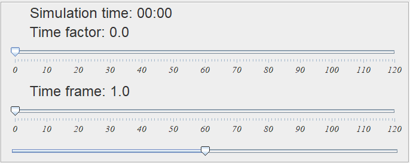

# Dynamic Ship Domain Linear Velocity Obstacle algorithm
Dynamic Ship Domain Linear Velocity Obstacle (DSDLVO) is a project implemented in Java, which combines the Dynamic Ship Domains of [Bakdi et al, 2020](https://www.mdpi.com/2077-1312/8/1/5) with the linear velocity obstacle algorithm from [Huang et al,2018](https://www.sciencedirect.com/science/article/abs/pii/S0029801818300015).  
The project uses AIS data read from a CSV file acquired from [Danish Maritime Authority (FTP link)](ftp://ftp.ais.dk/ais_data/).  
This project is made as a part of a bachelor project from Aalborg University. The report related to this project, can be seen at [Report link](https://www.youtube.com/watch?v=dQw4w9WgXcQ).

## Setup of Java program
The program comes with the Java 16 project and a python 3.8 project. 
The Java project contains the implementation of the dynamic ship domain and the velocity obstacle algorithm, as well as a CSV reader which reads the AIS data.

* **Define input file:** 
  The GitHub repository contains a set of predefined input files [Input InputFiles](https://github.com/dkalaxdk/P6-Projekt/tree/master/InputFiles).  
  Upon opening the application, the user will be prompted to select the input file, and the MMSI which should be considered as Own Ship. 
  The program repository also contains a python script to define a custom input file. [Input File Creator](#setup-of-input-file-generator) 
  If an external input file is used, it should adhere to the same standards as the defined inputs files. The entries are comma separated, and SOG, COG ,Length ,Heading ,longitude ,latitude should be floats.
* **Define MMSI** 
  When running the program, the Own Ship (OS) should be defined. Therefore, the MMSI of the ship that should be interpreted as the OS, should be defined.
* **Build the project** 
  After the correct file have been selected, the project should be built.  
* **Run the project**

## Running the program
When running the program, the user is presented with an interface containing a ship (OS) with its ship domain in the center. In the top right the user is presented with 3 sliders.

1. **Time factor**   Simulation speed control which defines the speed of the simulation.
2. **Time frame**   This defines the time frame in which the VO should look for collisions (Minutes).
3. **Zoom**   Allows you to zoom in and out.

### Reading the Program
As the program runs through a simulation with other ships, the time frame can be extended/decreased to find the time in which a collision may occur.  
If no collisions are detected at the current time frame, the cones will remain grey as seen in the image bellow.  
  
Whereas if a collision is predicted, the cone will turn red (see image below). 

# Setup of input file generator

The python input file creator reads the content of [input.txt](https://github.com/dkalaxdk/P6-Projekt/blob/master/DataGenerator/input.txt), which should be structured as a CSV file.  
The CSV file should have the following structure:  

**X**|**Y**|**SOG**|**COG**|**Heading**|**Length**|**Width**
:-----|:-----|:-----|:-----|:-----|:-----|:-----
X Coordinates, which will be converted to longitude. |Y coordinates, which will be converted to latitude. |Speed of the vessel in knots.| Course over ground, which defines the direction the ship is sailing. This will be a constant direction. | Heading in degrees.| Length of the ship in meters. | Width of the ship in meters. 

The first line in the input file defines a ship with MMSI 1, second row defines a ship with MMSI 2, and each line will add a new ship to generated_file.csv.  

The input file generator overrides the [InputFiles/generated_file.csv](https://github.com/dkalaxdk/P6-Projekt/blob/master/InputFiles/generated_file.csv). To use this, the input file in the Java program should be defined as the generated_file.  

After having defined the inputfile.txt, the python project should be built and run. Upon running, the python project will prompt for the amount of minutes that should be simulated.
